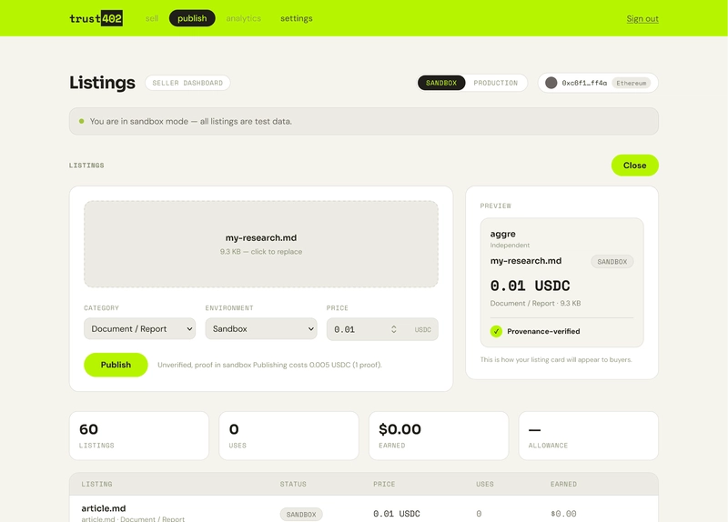

## TL;DR

x402 is the protocol that lets AI agents pay autonomously. What it never gave them was a way to know whether what they were about to buy was genuine. Trust402 uses zero-knowledge proofs so agents can verify content before paying — without the content ever being revealed.

---

## It's a black box. The contents are amazing data. One dollar — interested?

Nobody would buy that. And yet this happens up to a billion times a day.


As AI agents expand what they can do, every layer — agent-to-agent communication, tool integration, payments, authentication — is being standardized. **x402** is the payment layer. Coinbase announced it in May 2025. The idea is simple: revive HTTP's 402 status code ("Payment Required" — a name that always existed and was almost never used) and standardize the full flow from stating payment terms, through confirming the buyer can pay, to settlement and returning the response. The entire payment process became a plain API call that machines can execute.

Today the x402 Foundation sits under the Linux Foundation, with Coinbase, Cloudflare, Stripe, and others as members. A Chainalysis report says x402 **crossed 100 million transactions on Base in its first nine months**. Transactions above $1 now account for 95% of volume, up sharply from 49% a year earlier.

**But that 100 million is still only a fraction of actual payment intent.**

There is an estimate that "**Cloudflare's network serves up to a billion 402 responses every day**"[^1]. A 402 response is the server saying "this is paid content — please pay," so servers are asking for payment **a billion times a day**, and only a sliver of those requests settle.

Agents check the price, and then… walk away.

You can hardly blame them: a black box tells you nothing about its value.

Agents can pay now. What they still cannot do is judge whether what they are about to buy is real. Is that JSON labeled "dataset" actually a dataset? Has the document been tampered with? Does the code hide a backdoor? Things a human would check before buying are guaranteed by nothing in the protocol. The spec is clean; something is still missing.

There is a structural gap.

## You can pay — but you cannot confirm why you should.

We built Trust402 to close that gap.

## Trust402: "It's a black box — here is the certificate of contents"

Trust402 is a **verifiable content marketplace** built on top of x402.

Creators and researchers can list their work — documents, datasets, code, models — with a **ZK proof (zero-knowledge proof)** attached. Buyers (human or agent) verify the proof, complete an x402 payment, and receive the content.

A ZK proof can assert, for example:

> This data holds at least 1,000 distinct values and has not been tampered with.

— without ever showing the file. A buyer agent verifies the proof before paying and decides whether the thing is genuine and worth the price. Payment stays with x402; authenticity is carried by the ZK proof.

Proof generation, document registration, and storefront publishing all run from the SDK and the dashboard. We built the first version at ETHGlobal; it now runs in production on Cloudflare Workers + Base. We recently opened the dashboard at [lemma.frame00.com/trust402/sell](https://lemma.frame00.com/trust402/sell).

## Try it

The dashboard is the easiest way in.

1. Open [lemma.frame00.com/trust402/sell](https://lemma.frame00.com/trust402/sell),
2. Click "dashboard" and connect a wallet,
3. Drag a file onto the listing form, set a category and price (USDC),
4. Hit "Publish."

Under the hood, `@trust402/sdk`'s `publish()` runs everything from proof generation through storefront upload.



Everything the dashboard can do is also available from the SDK. The dashboard uses a hash-based proof that works for any file type (a no-tamper proof). With the SDK you can also build proofs that dig into the actual content of specific formats. For example, with the built-in ZK circuit `blogArticle (blog-article-v1.2)`, which can fold author, word count, and language into the proof, the minimal code to list a blog article looks like this:

```typescript
import { create, publish, blogArticle } from "@trust402/sdk";

// 1. Create a client
const client = create({
  apiKey: "your-lemma-api-key",
  getSigner: async () => ({
    provider: window.ethereum,
    address: account.address,
  }),
  onPayment: (info) => console.log(`paid ${info.amount} micro-USDC`),
});

// 2. Build witness and commitment from the article
const { witness, commitment } = blogArticle({
  author: "aggre",
  published: Date.now(),
  body: "# My Article\n\nHello, Trust402.",
  words: 7,
  lang: "en",
});

// 3. Generate the proof, register the document, publish the listing
const listing = await publish(client, {
  circuitId: "blog-article-v1.2",
  witness,
  commitment,
  price: { amount: 5000, currency: "USDC" },
  did: `did:pkh:eip155:84532:${account.address}`,
  environment: "sandbox",
  file: new File(["# My Article\n\nHello, Trust402."], "article.md", {
    type: "text/markdown",
  }),
  category: "document",
  payoutAddress: account.address,
});
```

What `publish()` does under the hood:

1. **Generate a ZK proof**: fetch the circuit for `circuitId` (Groth16, a kind of ZK-SNARK) and build a proof from the witness (the private inputs the proof is built from).
2. **Register the document**: register the document with the Lemma API and submit the proof (an x402 payment runs automatically here — Trust402's own usage fee).
3. **Compute `listingRoot`**: deterministically derive an ID that uniquely identifies the listing.
4. **Publish to the storefront**: if a file was passed, upload it directly to the storefront.

Three calls (`create` → `blogArticle` → `publish`) connect ZK proof generation all the way to a storefront listing.

## Custom circuits

So far we used a circuit shipped with the dashboard and SDK, such as `blog-article-v1.2`. Trust402 also lets you **use any circuit you register**. That unlocks claims like:

- List a dataset → "This dataset holds 1,000 or more records"
- List code → "This code uses React and has 30 or more components"
- List a model → "This model has 7B or more parameters"

Making these verifiable and wiring them into Trust402's listing flow deserves its own post — this one is already long enough. Next time we'll walk through a custom circuit such as `research_dataset` in code, and show how an agent can check the claim before it pays.

Trust402 is in preview at [lemma.frame00.com/trust402/sell](https://lemma.frame00.com/trust402/sell). As x402 standardized the payment layer, Trust402 aims to be the standard pattern for verifiable content trade.

---

[^1]: CoinDesk, "AI Agents Are Breaking Web Economics, but Cloudflare Says x402 Can Help" (May 5, 2026). Cloudflare CSO Stephanie Cohen, Consensus Miami 2026.
